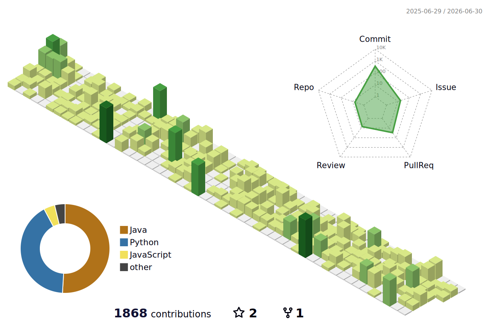

# Hi! I'm YEHUN CHANG!

## My Tech Stack 🚀
### 💻 About Backend

### 📖 About Data Science, Data Analysis, AI  

## 🧑‍🏫 Career and Education
  **Postype** (Seoul/Korea) 
_**Backend Engineer**, SEP 2025~present  

🧑‍💻 **KakaoTech Bootcamp** (Pangyo/Korea) 
_**FullStack Student**, JAN 2025-AUG 2025 
* Team Leader of 1st Project (Jan 2025 – Mar 2025) 
* Team Leader of 2nd Project (Mar 2025 – Aug 2025); **Awarded First Prize** (Best Project) 
* Selected as **Outstanding Trainee** in Full-Stack Course (Mar 2025) and **Outstanding Graduate** (Aug 2025) 

🤖 **Sogang University** (Seoul/Korea) 
_**Master's degree of Data Science&Artifical Intelligence**, SEP 2023-present_ 

🪖 **ROK Airforce Officer** (GwangjuAB and OsanAB) 
_**Intelligence Officer, from 2ndLT to Captain**, MAR 2019-DEC 2024_ 

✈️⚙️ **ROK Airforce Academy** (Cheongju/Korea) 
_**Bacheor's degree of Aerospace Engineering**, MAR 2015-MAR 2019_ 

## 💡Certificate
|   date   |                 certificate                  |                           agency                            |
|:--------:|:--------------------------------------------:|:-----------------------------------------------------------:|
| JUN 2024 |                     SQLD                     |             Korea Data Agency (한국데이터산업진흥원)              |
| JUN 2024 | Engineer Information Processing (정보처리기사) | Human Resources Developnemt Service of Korea (한국산업인력공단) |
| JUN 2023 |                     ADsP                     |             Korea Data Agency (한국데이터산업진흥원)              |

